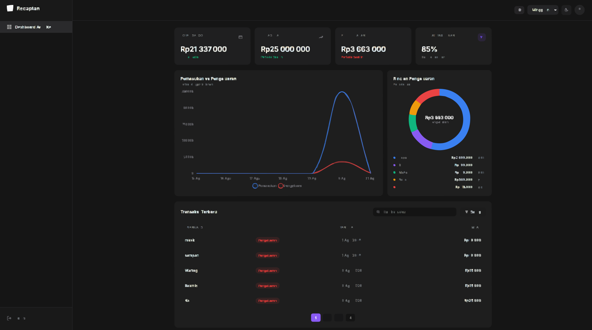
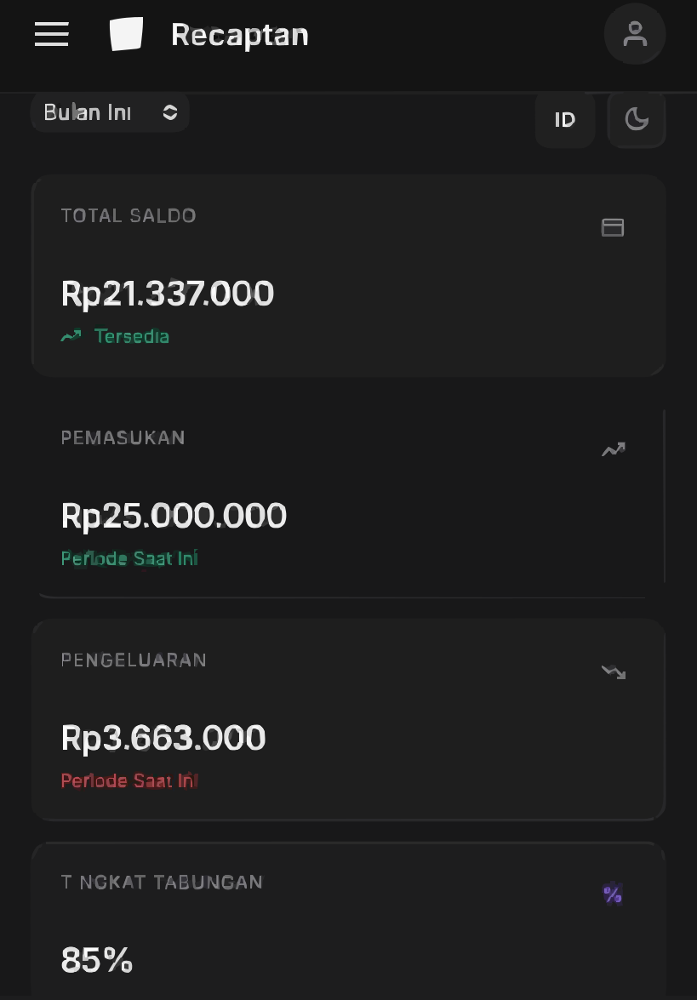
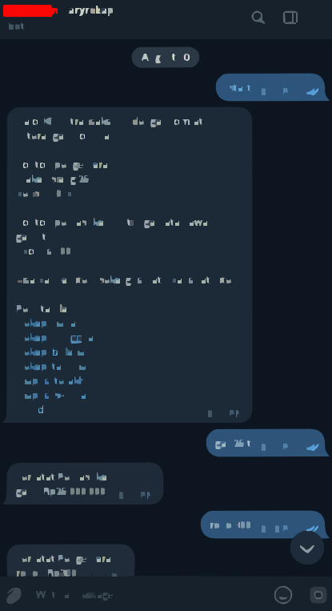

# 🚀 Recaptan | Serverless Finance Tracker & Dashboard
Recaptan — A simple and aesthetic personal expense tracker for monitoring daily, weekly, monthly, and yearly expenses.

*Read this in other languages: [Indonesian](README.id.md).*

Recaptan is a **Serverless-based** cash flow management application fully integrated with the **Telegram Bot API**. This project is designed to log daily transactions quickly via chat and visualize them in real-time through an interactive web dashboard without requiring manual page reloads.

---

## 🔗 Live Demo
- **Dashboard URL:** [Insert your Cloudflare Worker URL here, e.g., https://expense-bot.mayorbrutalty.workers.dev/]
- **Access Code:** `12345` *(Insert your demo access code here)*

---

## 📸 App Preview

*(Add your screenshots or GIFs here)*

| Desktop Dashboard | Mobile Dashboard | Telegram Bot |
| :---: | :---: | :---: |
|  |  |  |

---

## ✨ Key Features

- ⚡ **Real-time Background Polling:** The dashboard automatically syncs data from the server every 15 seconds without reloading the page (Single Page Application).
- 🤖 **Natural Language Parsing:** Simply type `lunch 20k` or `salary 5jt` in Telegram, and the bot will automatically parse the numbers and descriptions.
- 📊 **Smart Auto-Categorization:** The system intelligently extracts the first word of the user's input to serve as an expense category on the Donut Chart.
- 📱 **Mobile-First & Dynamic Viewport:** Utilizes `100dvh` to ensure flawless UI presentation on mobile browsers (like iOS Safari) without getting cut off by the address bar.
- 🌓 **Dark/Light Mode & i18n:** Supports dark/light themes and multi-language localization (EN/ID) stored in `localStorage`.
- 🗂️ **Data Pagination:** Displays transaction history neatly using a client-side pagination system (5 items per page).

---

## 🛠️ Tech Stack & Architecture

This project is built **without heavy frameworks** (No React/Vue) to demonstrate a strong mastery of JavaScript fundamentals and client-side performance optimization.

*   **Backend / Serverless:** Cloudflare Workers (Edge Computing)
*   **Database:** Cloudflare KV (Key-Value NoSQL Storage)
*   **Frontend:** Vanilla JavaScript, HTML5, CSS3
*   **Third-party Integration:** Telegram Bot API (Webhook)
*   **Data Visualization:** Chart.js

---

## ⚙️ How it Works

1. The user sends a message to the Telegram Bot (e.g., `Gas 50k`).
2. The Telegram API sends a *Webhook* payload to Cloudflare Workers.
3. Cloudflare Workers parses the text using Regex, determines if it is an `in` (Income) or `out` (Expense), and saves it into **Cloudflare KV**.
4. On the Frontend, the web dashboard performs lightweight polling every 15 seconds to the Worker's API endpoint. If the data hash changes, the DOM and Chart.js instances are re-rendered instantly.

---

## 🚀 Local Installation & Deployment

If you want to deploy this project yourself:

1. Clone this repository.
2. Create a new Bot via `BotFather` on Telegram and get the `BOT_TOKEN`.
3. Create a new Worker in your Cloudflare account, add a KV Namespace bound to `EXPENSES_KV`.
4. Add `BOT_TOKEN`, `TARGET_CHAT_ID`, and `DASHBOARD_SECRET` to the Cloudflare Environment Variables.
5. Paste the `worker.js` code into the Cloudflare Workers editor and Deploy.
6. Set the Telegram Webhook to your Cloudflare Worker URL.
